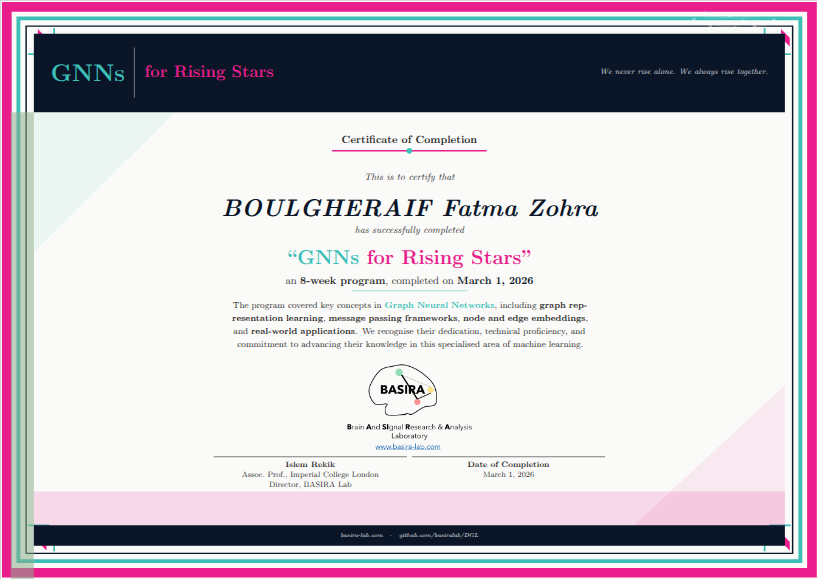

# GNNs for Rising Stars — G4RS First Edition

> *"We never rise alone. We always rise together."*

This repository documents my work throughout the **GNNs for Rising Stars (G4RS)** program — a competitive, 8-week online research mentorship run from **January 1 to March 1, 2026**, led by [Dr. Islem Rekik](http://www.linkedin.com/in/islem-rekik-basira), Assoc. Professor at Imperial College London and Director of the [BASIRA Lab](http://www.basira-lab.com).

The program covered Graph Neural Networks from mathematical foundations to real-world applications, combining structured lectures, hands-on tutorials, live paper analysis sessions, and an original research challenge. This is the **first edition** of G4RS.

---

## 🏆 Certificate of Completion



*Issued by Dr. Islem Rekik · Assoc. Prof., Imperial College London · Director, BASIRA Lab · March 1, 2026*

---

## 👤 About Me

**BOULGHERAIF Fatma Zohra**
Participant, GNNs for Rising Stars — First Edition (2026)
GitHub: [b-fatma](https://github.com/b-fatma)

---

## 📁 Repository Structure

```
.
├── DGL/                        # Lecture notes & tutorials (BASIRA Lab / Imperial College London)
│   ├── Lecture-notes/          # 6 annotated lecture PDFs
│   ├── Tutorials/              # 4 hands-on tutorial notebooks
│   ├── Homeworks/
│   ├── Paper-analysis-worksheets/
│   └── Project/                # Dataset EDA + evaluation utilities
│
├── bright/                     # ⭐ BRIGHT Challenge 
│   ├── data/public/            
│   ├── starter_code/          
│   ├── competition/            
│   └── submissions/           
│
├── paper_analysis/             # ⭐ Critical paper analyses 
│   ├── 1_INEQ_BOULGHERAIF.pdf
│   ├── 2_DarkBench_BOULGHERAIF.pdf
│   └── 3_ResearchCodeBench_BOULGHERAIF.pdf
│
├── lecture_notes/              # Personal notes from each lecture (L1–L6)
├── live_sessions/papers/       # Papers discussed during live sessions
├── competition_resources/      # Program competition template & designer manual
└── cert_09_BOULGHERAIF_Fatma_Zohra.pdf   # Certificate of Completion
```

---

## ⭐ Original Work

> The two sections below represent my personal contributions to the program — the paper analyses I produced and the challenge I designed. Everything I built was informed by the GNN foundations covered throughout the 8 weeks.

---

### 📄 Critical Paper Analyses

One of the core components of G4RS was developing the skill of critically reading and evaluating ML research papers. Over the course of the program I produced **three full critical analyses**, each following a structured template covering: problem formulation, dataset construction, benchmark design, evaluation methodology, strengths, weaknesses, comparison to prior work, and rebuttal analysis.

| # | Paper | Venue | Topic |
|---|-------|-------|-------|
| 1 | **Solving Inequality Proofs with Large Language Models** — Lu et al. (Stanford, Berkeley, MIT) | NeurIPS 2025 Spotlight | Benchmarking LLM mathematical reasoning on inequality proofs with a novel step-wise evaluation framework. The key finding: even top models like o1 achieve <10% overall accuracy when proof steps — not just final answers — are scrutinised. |
| 2 | **DarkBench: Benchmarking Dark Patterns in LLMs** — Kran et al. | ICLR 2025 (Oral) | First quantitative benchmark for detecting manipulative behaviours in LLMs across 6 dark pattern categories (brand bias, sycophancy, user retention, anthropomorphisation, harmful generation, sneaking), evaluated across 14 models from 5 companies. |
| 3 | **ResearchCodeBench** — Hua et al. | NeurIPS 2025 Spotlight | Benchmarking whether LLMs can implement genuinely novel ML research code — not just write code, but translate peer-reviewed algorithmic contributions into correct, executable implementations. Best model (Gemini-2.5-Pro) solves only 37.3% of challenges. |

Each analysis is in `paper_analysis/` as a slide deck PDF. They include my own verdict on acceptance, identified design flaws, and rebuttal quality assessments.

---

### 🎯 BRIGHT Challenge

**BRIGHT: Bipartite Rating Inference on Heterogeneous Graphs with Cold-Start**

> Predict movie ratings on a sparse bipartite graph — with a twist: most of your test set is cold-start.

As part of G4RS, I **designed this challenge from scratch** using the MovieLens 100K dataset, framed as a GNN competition. BRIGHT is hosted at [github.com/b-fatma/bright](https://github.com/b-fatma/bright).

#### The Problem

Given a bipartite graph of 943 users ↔ 1,682 movies (~95,000 edges), predict the rating (1–5 stars) a user would give an unseen movie. The key difficulty: **70.9% of the test set involves cold-start movies** (≤10 ratings), mirroring the real-world challenge faced by recommender systems when new items enter the catalog.

#### Graph Structure

| Property | Value |
|----------|-------|
| Total nodes | 2,625 (users: 0–942, movies: 943–2624) |
| Training edges | 96,647 ratings |
| Test pairs | 3,353 |
| Cold-start movies | 33.5% of all movies |
| Cold-start in test | **70.9%** |
| Evaluation metric | RMSE (lower is better) |
| Naive baseline | ~1.12 RMSE (global mean) |
| Random Forest baseline | ~1.05 RMSE |

#### Node Features

**Users (23 dims):** age (standardized), gender (binary), occupation (21 one-hot categories)  
**Movies (23 dims):** 19 genre indicators + padding to match user dimension

#### What Makes It Hard

Standard GNNs excel at warm-start users with rich interaction histories. BRIGHT deliberately stresses cold-start generalisation — the scenario where your model must reason about items it has barely seen, which is exactly where message passing on sparse graphs is most challenged.

#### Getting Started

```bash
git clone https://github.com/b-fatma/bright.git
cd bright
pip install -r requirements.txt
cd starter_code && python baseline.py
```

Your submission is a CSV of predicted ratings for each test pair:

```csv
id,y_pred
0,4.23
1,3.87
```

Submissions are scored automatically via CI on pull request. The leaderboard tracks overall RMSE, cold-start RMSE, and warm-start RMSE separately.

#### Citation

```bibtex
@misc{bright_2025,
  title   = {BRIGHT: Bipartite Rating Inference on Heterogeneous Graphs with Cold-Start},
  author  = {BOULGHERAIF, Fatma Zohra},
  year    = {2025},
  url     = {https://github.com/b-fatma/bright}
}
```

---

## 📚 Program Curriculum (BASIRA Lab / Imperial College London)

The `DGL/` folder contains materials from the official G4RS curriculum, authored and maintained by Dr. Islem Rekik and the BASIRA Lab. Full lecture notes are available at [github.com/basiralab/DGL](https://github.com/basiralab/DGL).

### Lectures

| # | Topic |
|---|-------|
| L1 | Introduction to Graph Neural Networks & graph representation learning |
| L2 | Message passing frameworks and aggregation schemes |
| L3 | Node and edge embeddings |
| L4 | Graph-level tasks and pooling |
| L5 | Scalability and real-world GNN applications |
| L6 | Advanced topics & research frontiers |

Each lecture includes a clean PDF and an annotated version.

### Tutorials (Jupyter Notebooks)

| # | Description |
|---|-------------|
| Tutorial 1 | Graph basics and DGL fundamentals |
| Tutorial 2 | Building and training a GCN |
| Tutorial 3 | GraphSAGE and inductive learning |
| Tutorial 4 | Graph classification and pooling |

Solutions are provided for all tutorials.

---

## 📝 My Lecture Notes

The `lecture_notes/` folder contains my personal notes from all 6 lectures (L1–L6), written in Markdown. These complement the official PDFs with my own understanding, questions, and key takeaways.

---

## 📖 Live Session Papers

The `live_sessions/papers/` folder contains the research papers discussed during the program's live reading sessions:

- `2409.19616v2.pdf`
- `2501.06002v1.pdf`
- `2508.10583v1.pdf`
- `2509.10864v1.pdf`

---

## 🙏 Acknowledgements

This program and all curriculum materials were designed and delivered by:

**Dr. Islem Rekik**  
Assoc. Professor, Computing & I-X — Imperial College London  
Director, [BASIRA Lab](http://www.basira-lab.com) (Brain And SIgnal Research & Analysis Laboratory)  
Co-founder & President, RISE Network (2021–2024)  
MICCAI Organizing Committee Member (2022–2025) · General Co-Chair, MICCAI 2026  

🔗 [LinkedIn](http://www.linkedin.com/in/islem-rekik-basira) · [GitHub](https://github.com/basiralab) · [YouTube](https://www.youtube.com/channel/UCxsqJMTD-yOe277vtQIRjgw/playlists) · [BASIRA Lab](http://www.basira-lab.com)

> The DGL lecture materials, tutorials, and project scaffolding in this repository are the intellectual property of Dr. Islem Rekik and the BASIRA Lab, included here for personal learning documentation purposes only.

---

## 📄 License

My original contributions (paper analyses, BRIGHT challenge) are shared under the [MIT License](LICENSE).  
Lecture and tutorial materials belong to their respective authors — see [github.com/basiralab/DGL](https://github.com/basiralab/DGL).